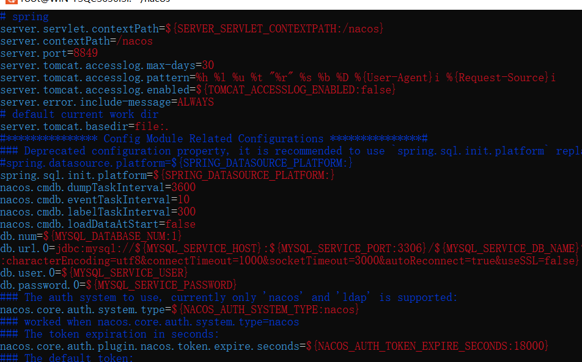

# docker启动nacos

## 第一步，拉镜像

```dockerfile
docker pull nacos 
```

## 第二步，创建完美nacos容器

```bash
1.先简单启动一个简易的nacos容器
docker run -d --name nacos -p 8848:8848 -e PREFER_HOST_MODE=hostname -e MODE=standalone nacos/nacos-server
```

访问看看

http://localhost:8848/nacos/


我这个直接就可以进去了。但是别急

```bash
2.复制配置文件，在宿主机上运行这段代码
docker cp nacos:/home/nacos/conf /root/nacos/

3.关闭一开始创建的容器
docker stop nacos

4.docker run -d --name nacos1 -p 8848:8848 -v /root/nacos:/home/nacos/conf -e PREFER_HOST_MODE=hostname -e MODE=standalone nacos/nacos-server

5.这样就创建了一个完整的nacos，配置文件在宿主机的/root/nacos下面
```


## 第三步 检验

1.修改宿主机的nacos配置文件


2.重启一下docker的nacos，康康效果

结果肯定是看不到的，哈哈哈，因为端口号只开放了8848


3.重新创建一个，开放8849

提前把之前的都删了

```bash
docker run -d --name nacos1 -p 8849:8849 -v /root/nacos:/home/nacos/conf -e PREFER_HOST_MODE=hostname -e MODE=standalone nacos/nacos-server
```

4.浏览器检查，因为我改了配置文件，端口也开放了，浏览器没问题的话就ok了


## 注意新版nacos2版本会开放两个端口号

当nacos客户端升级为2.x版本后，新增了gRPC的通信方式，新增了两个端口。这两个端口在nacos原先的端口上(默认8848)，进行一定偏移量自动生成。

| 端口 | 与主端口的偏移量 | 描述                                                       |
| ---- | ---------------- | ---------------------------------------------------------- |
| 9848 | 1000             | 客户端gRPC请求服务端端口，用于客户端向服务端发起连接和请求 |
| 9849 | 1001             | 服务端gRPC请求服务端端口，用于服务间同步等                 |

所以，新版的要开放两个端口，默认情况下是8848和9848

先把配置文件进行修改，改成8848，配置文件在/root/nacos/application.properties

删除原有的nacos容器。




所以命令如下：

```
docker run -d --name nacos1 -p 8848:8848 -p 9848:9848 -v /root/nacos:/home/nacos/conf -e PREFER_HOST_MODE=hostname -e MODE=standalone nacos/nacos-server
```


