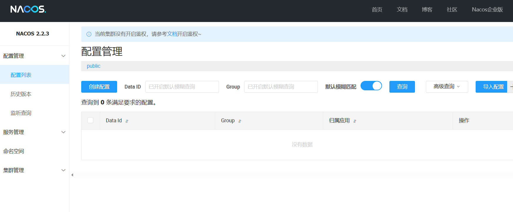
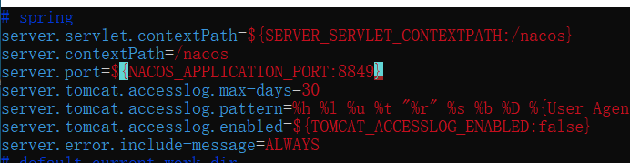
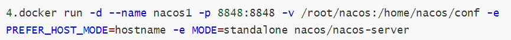
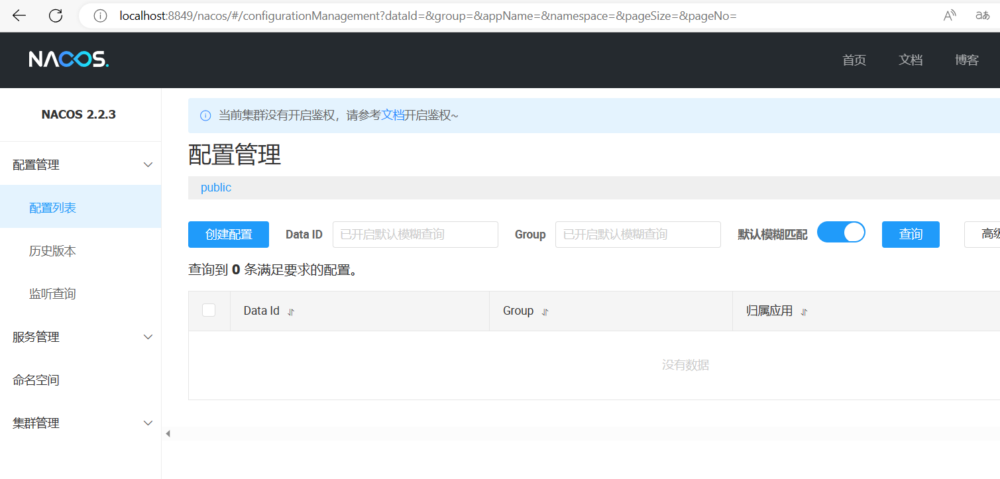

# docker启动nacos

## 第一步，拉镜像

```dockerfile
docker pull nacos 
```

## 第二步，创建完美nacos容器

```bash
1.先简单启动一个简易的nacos容器
docker run -d --name nacos -p 8848:8848 -e PREFER_HOST_MODE=hostname -e MODE=standalone nacos/nacos-server
```

访问看看

http://localhost:8848/nacos/



我这个直接就可以进去了。但是别急

```bash
2.复制配置文件，在宿主机上运行这段代码
docker cp nacos:/home/nacos/conf /root/nacos/

3.关闭一开始创建的容器
docker stop nacos

4.docker run -d --name nacos1 -p 8848:8848 -v /root/nacos:/home/nacos/conf -e PREFER_HOST_MODE=hostname -e MODE=standalone nacos/nacos-server

5.这样就创建了一个完整的nacos，配置文件在宿主机的/root/nacos下面
```


## 第三步 检验

1.修改宿主机的nacos配置文件



2.重启一下docker的nacos，康康效果

结果肯定是看不到的，哈哈哈，因为端口号只开放了8848



3.重新创建一个，开放8849

提前把之前的都删了

```bash
docker run -d --name nacos1 -p 8849:8849 -v /root/nacos:/home/nacos/conf -e PREFER_HOST_MODE=hostname -e MODE=standalone nacos/nacos-server
```

4.浏览器检查，因为我改了配置文件，端口也开放了，浏览器没问题的话就ok了



## 完美收工
