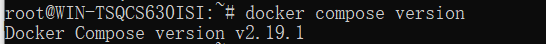
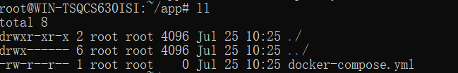
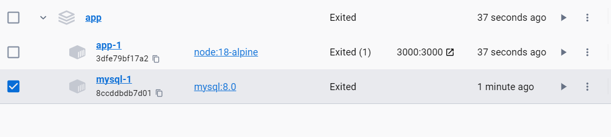
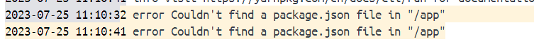

# docker制作compose

## 第一步，先了解Compose是什么？

Compose 项目是 Docker 官方的开源项目，负责实现对 Docker 容器集群的快速编排。

Compose有两个重要的概念

1.项目  ：由一组关联的应用容器组成的一个完整业务单元，在docker-compose.yml文件中定义

2.服务  ：一个应用的容器

官方文档的解释：

```bash
Docker Compose is a tool that was developed to help define and share multi-container applications. With Compose, we can create a YAML file to define the services and with a single command, can spin everything up or tear it all down.

The big advantage of using Compose is you can define your application stack in a file, keep it at the root of your project repo (it’s now version controlled), and easily enable someone else to contribute to your project. Someone would only need to clone your repo and start the compose app. In fact, you might see quite a few projects on GitHub/GitLab doing exactly this now.
```

## 第二步，docker compose 安装与卸载

```bash
If you installed Docker Desktop for Windows, Mac, or Linux you already have Docker Compose! Play-with-Docker instances already have Docker Compose installed as well.
```

如果你安装了windows桌面版的话，就已经自带了Docker Compose

如果不是使用windows桌面版的话，[Install the Compose plugin | Docker Documentation](https://docs.docker.com/compose/install/linux/)，这个网址会教你如何安装

## 第三步，Use Docker Compose

```bash
1.查看是否成功安装docker compose
docker compose version
```



```bash
At the root of the /getting-started/app folder, create a file named docker-compose.yml.
在文件夹的跟目录创建名字叫docker-compose.yml这个的文件
```



```bash
services:
```

先在文件中定义好服务

现在我们基于这个框架，来实现我们的docker Compose

```bash
docker run -dp 127.0.0.1:3000:3000 \
  -w /app -v "$(pwd):/app" \
  --network todo-app \
  -e MYSQL_HOST=mysql \
  -e MYSQL_USER=root \
  -e MYSQL_PASSWORD=secret \
  -e MYSQL_DB=todos \
  node:18-alpine \
  sh -c "yarn install && yarn run dev"
```

这只是的样式，就是说不用你打，我们只是照着这个写docker compose

1.首先，让我们定义容器的服务条目和映像。我们可以为服务选择任何名称。 该名称将自动成为网络别名，这在定义我们的 MySQL 服务时很有用。

```bash
services:
  app:
    image: node:18-alpine
```

2.设置我们的命令，如同上面样式的sh -c "yarn install && yarn run dev"

```bash
services:
  app:
    image: node:18-alpine
    command: sh -c "yarn install && yarn run dev"
```

3.设置端口号 ，如同上面样式的 127.0.0.1:3000:3000

```yml
services:
  app:
    image: node:18-alpine
    command: sh -c "yarn install && yarn run dev"
    ports:
      - 127.0.0.1:3000:3000
```

4.接下来就是设置工作目录和挂载目录

```yml
services:
  app:
    image: node:18-alpine
    command: sh -c "yarn install && yarn run dev"
    ports:
      - 127.0.0.1:3000:3000
    working_dir: /app
    volumes:
      - ./:/app
```

就是当前目录和容器里面的工作目录挂载

5.Finally, we need to migrate the environment variable definitions using the key.`environment`

就是设置容器里面的环境，比如说mysql数据库就需要user ，password，这方面不熟的可以去看我github的文档[docker-everything/docker完美启动任何容器 at master · nanshaws/docker-everything (github.com)](https://github.com/nanshaws/docker-everything/tree/master/docker完美启动任何容器)

```yml
services:
  app:
    image: node:18-alpine
    command: sh -c "yarn install && yarn run dev"
    ports:
      - 127.0.0.1:3000:3000
    working_dir: /app
    volumes:
      - ./:/app
    environment:
      MYSQL_HOST: mysql
      MYSQL_USER: root
      MYSQL_PASSWORD: secret
      MYSQL_DB: todos
```

编写项目第一部分算是完成了，第二部分就是Define the MySQL service，再次强调这个项目是一下子创建两个容器，一个是node，一个是mysql

样式：

```bash
docker run -d \
  --network todo-app --network-alias mysql \
  -v todo-mysql-data:/var/lib/mysql \
  -e MYSQL_ROOT_PASSWORD=secret \
  -e MYSQL_DATABASE=todos \
  mysql:8.0
```

根据样式开始编写代码

```yml
services:
  app:
    # The app service definition  //这里就是之前定义好的
  mysql:
    image: mysql:8.0
```

这里定义了一下mysql的镜像

在设置挂载

```yml
services:
  app:
    # The app service definition
  mysql:
    image: mysql:8.0
    volumes:
      - todo-mysql-data:/var/lib/mysql
    environment:
      MYSQL_ROOT_PASSWORD: secret
      MYSQL_DATABASE: todos

volumes:
  todo-mysql-data:
```

完整代码如下： 

```yml
services:
  app:
    image: node:18-alpine
    command: sh -c "yarn install && yarn run dev"
    ports:
      - 127.0.0.1:3000:3000
    working_dir: /app
    volumes:
      - ./:/app
    environment:
      MYSQL_HOST: mysql
      MYSQL_USER: root
      MYSQL_PASSWORD: secret
      MYSQL_DB: todos

  mysql:
    image: mysql:8.0
    volumes:
      - todo-mysql-data:/var/lib/mysql
    environment:
      MYSQL_ROOT_PASSWORD: secret
      MYSQL_DATABASE: todos

volumes:
  todo-mysql-data:
```

## 第四步，开始运行

```bash
docker compose up -d
```



成功，如果app-1出现了



这个问题，很明显是缺这个package.json的这个文件，就是挂载的/app缺少这个文件，这个问题很常见，如果是看过我用过docker完美启动tomcat的话，就知道怎么做了，这个问题的原因就是挂载的时候把原来的文件清空了，因为它是以宿主机为挂载目录的，办法就是先启动一个什么都没有的容器，然后复制过去。