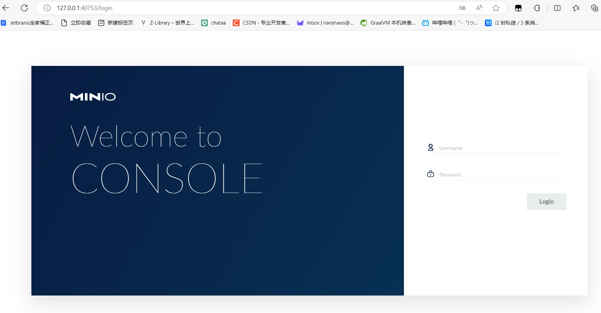
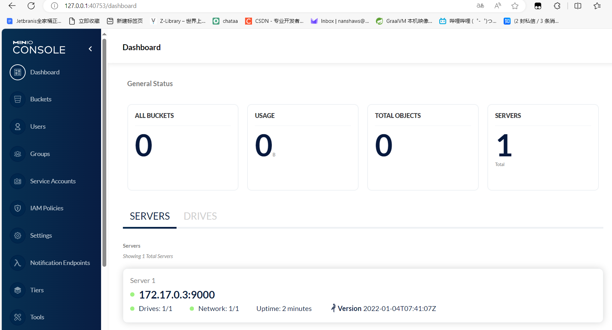

# docker完美启动minio

## 第一步：拉取镜像

```dockerfile
docker pull minio/minio
```

## 第二步：创建用于存储MinIO数据的卷

MinIO需要一个用于持久化存储的卷。创建一个目录，并使用`docker volume create`命令创建一个Docker卷：

```
mkdir ~/minio-storage  # 在用户主目录下创建一个用于存储的目录
docker volume create minio-data  # 创建一个名为minio-data的Docker卷
```

## 第三步：运行MinIO Docker容器

```
docker run -p 9000:9000 --name minio -e "MINIO_ACCESS_KEY=your-access-key" -e "MINIO_SECRET_KEY=your-secret-key" -v minio-data:/data minio/minio server /data
```

替换`your-access-key`和`your-secret-key`为您选择的自定义访问密钥和秘密密钥。

**注意**： Access key length should be at least 3, and secret key length at least 8 characters

就是your-access-key必须大于3，your-secret-key必须大于8

比如说，我要自定义 your-access-key为123456 和 your-secret-key为123456789

```
docker run -p 9000:9000 --name minio -e "MINIO_ACCESS_KEY=123456" -e "MINIO_SECRET_KEY=123456789" -v minio-data:/data minio/minio server /data
```

这样是可以运行的，但MINIO_ACCESS_KEY和MINIO_SECRET_KEY已经被弃用，建议使用MINIO_ROOT_USER和MINIO_ROOT_PASSWORD。同时，控制台端点正在监听一个动态端口（40753），建议使用--console-address ":PORT"来选择一个静态端口。

## 注意

新版mino是这样的。

API: http://172.17.0.3:9000  http://127.0.0.1:9000            api是9000端口
Console: http://172.17.0.3:40753 http://127.0.0.1:40753    console是40753端口
Documentation: https://docs.min.io

## 所以：真正的代码如下

比如说，我要自定义 MINIO_ROOT_USER为root 和 MINIO_ROOT_PASSWORD为123456789

```
docker run -p 9000:9000 -p 40753:40753 --name minio   -e "MINIO_ROOT_USER=root"   -e "MINIO_ROOT_PASSWORD=123456789"   -v minio-data:/data   minio/minio server /data --console-address ":40753"
```

## 第五步：访问minioWeb

通过浏览器访问 `http://localhost:40753`



可以看到非常的帅气

## 第六步：登录

输入之前设置好的  root    和 123456789



这里就成功的部署完毕了。