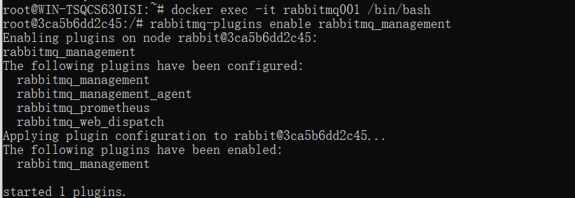
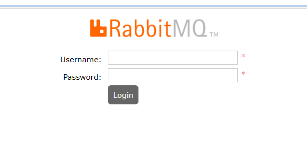

# docker启动rabbitmq

## 第一步，拉镜像

```bash
docker pull rabbitmq:3.8.16
```

## 第二步，创建完美容器

```bash
1.先启动一个不太完美的容器
docker run -it  --name rabbitmq -p 5672:5672 -p 15672:15672 rabbitmq:3.8.16

2.复制docker启动rabbitmq的配置文件
docker cp rabbitmq:/etc/rabbitmq/rabbitmq.conf /root/rabbitmq.conf

3.关闭docker的rabbitmq容器
crtl c

4.创建完美容器rabbitmq
docker run -it  --name rabbitmq001 -p 5672:5672 -p 15672:15672 -v /etc/rabbitmq/rabbitmq.conf:/root/rabbitmq.conf  rabbitmq:3.8.16

5.这里有个小坑，就是你创建完了，还要进入容器里面开启web服务，这样才能访问
docker exec -it rabbitmq001 /bin/bash
rabbitmq-plugins enable rabbitmq_management
cd /etc/rabbitmq/conf.d/
echo management_agent.disable_metrics_collector = false > management_agent.disable_metrics_collector.conf
exit
```



## 第三步，检验

在浏览器上输入http://127.0.0.1:15672/ 进行查看，出现这个，表示没有问题

